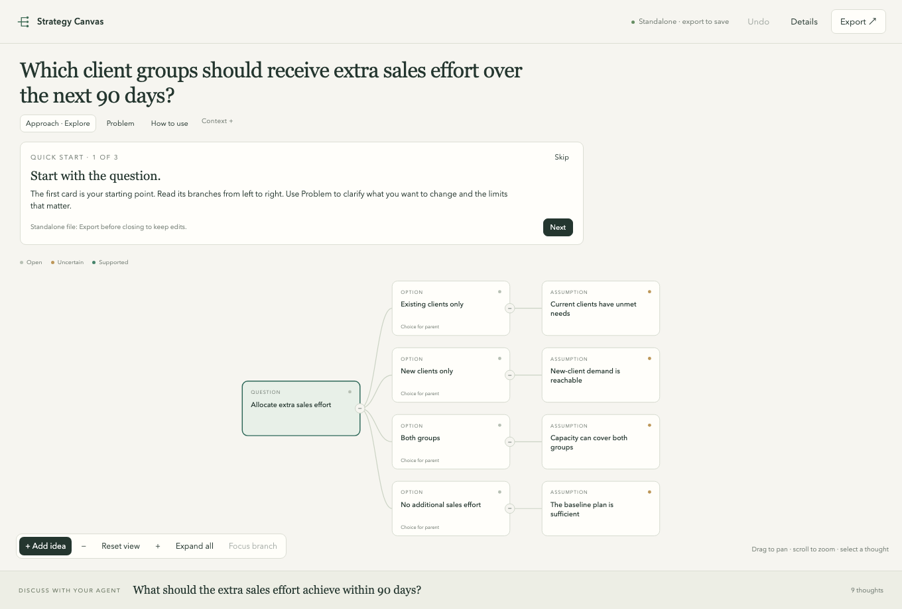

# Strategy Canvas

**See your options clearly. Work through a decision on your own or with your AI agent.**

Explore a choice in conversation while a visual tree keeps your options, assumptions and evidence in view. Open a promising branch, challenge it, and return to the wider picture when you need to.

**[Start with your question](https://jctkerr.github.io/strategy-canvas/new.html)** · [Explore a worked example](https://jctkerr.github.io/strategy-canvas/)



The demo is a fictional sales decision you can explore and edit. There is also a [fictional career example](https://jctkerr.github.io/strategy-canvas/career.html). Neither contains an AI conversation; export your changes before closing or reloading the tab.

**[James Kerr](https://jameskerr.me)** · Free and open source · [MIT licence](LICENSE)

## Use it for your decision

The **canvas** works manually: enter a question, add branches and edit as you think. The **skill** gives your agent instructions for working through the same decision with you.

For a manual start, open [a blank canvas](https://jctkerr.github.io/strategy-canvas/new.html). Enter a question or choose **Go straight to canvas** and add it later. Export the HTML to keep your work. To continue with an agent, attach the exported JSON and ask it to open a live session from that tree.

Copy this into your agent and replace the final question with your own:

```text
Use Strategy Canvas to help me think this through:
https://github.com/jctkerr/strategy-canvas

Set up the skill, follow its instructions and open the editable
canvas inside this app, beside our conversation. Reuse that view
as we work. Keep assumptions visible and leave the choice open.

My question: Where should I focus extra sales effort over the next
three months?
```

Use an agent with file access and code execution, such as Codex, Claude Code or Cursor. Your agent handles the setup; its usual access and costs apply. Check the compatibility record below for the exact workflows tested.

For installation, agent-specific commands or troubleshooting, see the **[agent guide](docs/agent-guide.md)**. Our **[compatibility record](docs/compatibility.md)** separates tested workflows from documented but untested setups.

## Think it through together

Start on the tree. **Quick start** and **How to use** are available when you want guidance.

1. **Start with your question.** Type it into a blank canvas or give your agent the situation and constraints. Use **Edit** beside the heading to refine it later.
2. **Explore and challenge.** Ask about one branch, click a thought to edit it, or use its **+** to add beneath it. The agent should build on your latest edits.
3. **Keep what you learn.** Ask for a complete HTML export, or use **Export** in the canvas. You can pause with open alternatives or compare them when ready.

Click **Tree type** on a card to open a small menu beside it. Choose once to save; **Undo** reverses the change. Children follow that type until a branch sets its own. **Example & help** holds the explanation and source. The menu marks a suitable type as **Suggested** when the card gives a clear clue; it keeps your existing choice until you select another. New children start with a suitable card kind, visible and editable above their wording.

With a card focused: **A** adds a child, **Shift+A** a sibling, **Enter/E** edits and **T** opens tree types. **Cmd/Ctrl+Enter** saves in an editor. **Escape** returns to the tree after saving; it keeps unsaved drafts. **Keyboard shortcuts** on the canvas shows navigation controls too.

**Analysis** keeps the next steps alongside the tree:

- **Numbers:** change assumptions and see formulas recalculate across three scenarios. Missing inputs and broken formulas stay visible.
- **Workplan:** connect an investigation to the question it could resolve, including the evidence needed and what you found.
- **Brief:** write your answer and supporting claims, link their sources and model results, then export an editable PowerPoint. A changed session flags an older brief for checking.

These are optional. Start with the tree and use them when they help. The [fictional workshop example](https://jctkerr.github.io/strategy-canvas/workshop.html) shows the complete workflow; its figures are illustrative assumptions, not evidence of demand.

For broader strategy work, your agent can use the [sourced business-framework recipes](references/business-frameworks.md). They explain Five Forces, SWOT/TOWS, the strategy kernel, the strategy choice cascade and the growth-share matrix in their intended scopes, with examples and limits. They are agent guidance, not five dedicated editors.

The tree makes reasoning visible. It does not establish that every option has been found or that its claims are true.

## Where your work lives

A live session saves on the computer running it: yours for a local agent, or the host's for a cloud agent. Use the preview your agent provides.

Downloaded HTML works on its own. Export before closing or reloading to keep your edits. To continue from those edits with your agent, export the JSON and attach it. Exports include the whole tree, notes and sources; review them before sharing.

The canvas has no accounts, analytics or automatic publishing. Your agent may process material through its own provider.

For the file format, API and export details, see the [runtime reference](references/schema.md).
