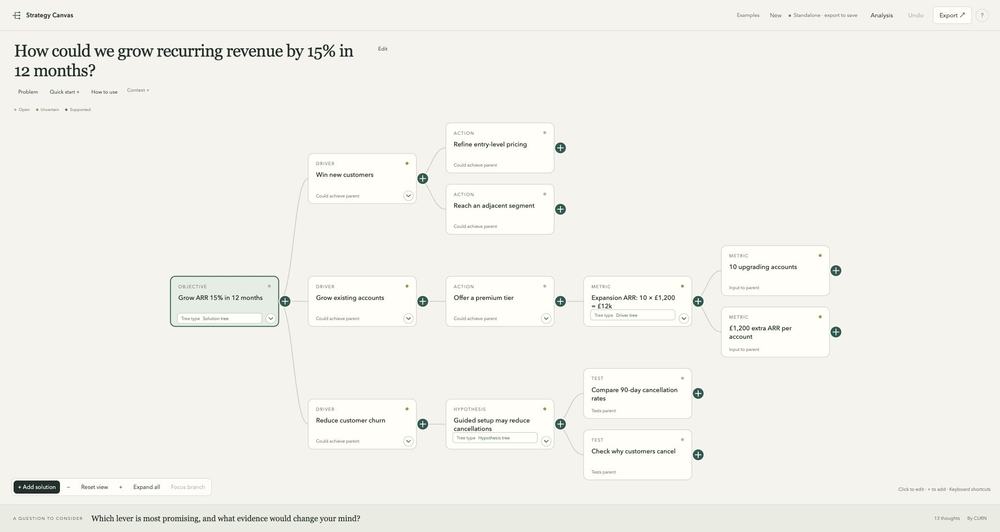

<h1 id="strategy-canvas"></h1>

By [CURN](https://www.curn.io/).

**Turn a question into a tree you can edit.**

See your options, assumptions and evidence together. Work with your AI tool or on your own.

[Explore the examples](https://jctkerr.github.io/strategy-canvas/examples.html) · [Try it in your browser](https://jctkerr.github.io/strategy-canvas/bookshop.html)

[](https://jctkerr.github.io/strategy-canvas/growth.html)

One canvas can hold different trees. Here, **drivers** describe ways to grow; deeper branches work through **numbers** and **tests**. This is a fictional example.

## With your AI tool

### 1. Open a new conversation

Use your existing account. These desktop steps are for Mac:

| App | Where to start |
| --- | --- |
| **Codex desktop** | New chat. Choose **Local** if asked. |
| **Claude desktop** | **Code** tab → **Local** → choose a folder. |
| **Cursor desktop** | Open a folder, then an **Agent** chat. |

Prefer another tool? It needs to open files and run code. [Other setups & help](docs/agent-guide.md). Your usual agent costs apply.

### 2. Paste this message

Replace the last line with your question, then press **Send**.

```text
Install and use Strategy Canvas:
https://github.com/jctkerr/strategy-canvas

Read the skill and open the canvas beside our chat.
My question: [type your question]
```

Your agent handles setup. The **skill** teaches it how to help; the **canvas** shows your tree.

### 3. Think it through

Your tree should appear beside the chat. Keep talking: **“Let's explore this branch.”** Your agent can suggest tree types and update the tree as you go.

Click a card to edit it or add notes, then **Save**. Use **+** to add a branch. **?** explains tree types; different branches can use different types.

Live sessions save on the computer running them. For a copy, ask: **“Give me a downloadable copy of this canvas.”**

[What we've tested](docs/compatibility.md) · [Picture guide](docs/images/strategy-canvas-setup-guide.png)

## Without an agent

1. [Open a blank canvas](https://jctkerr.github.io/strategy-canvas/new.html) and type your question.
2. Click a card to edit it or add notes; use **+** to add a branch.
3. Before closing or reloading, choose **Export → Interactive canvas**. Check that the file downloaded.

To continue with an agent, choose **Export → Editable state (JSON)** and attach the downloaded file.

## A worked example

**Could a bookshop run a workshop without losing money?**

1. **Break it down:** would people pay, can we run it, and what covers costs?
2. **Work one branch:** £20 tickets − £5 materials leaves £15 each. £120 fixed costs ÷ £15 = **8 paying attendees**.
3. **Find the next question:** what evidence suggests eight people would book?

These are fictional figures. If materials rise to £8, the threshold becomes **10 attendees** and the demand question changes too.

[Try the tree](https://jctkerr.github.io/strategy-canvas/bookshop.html) · [Follow the example step by step](docs/worked-example.md) · [Tree types & sources](references/tree-methods.md)

Free and open source · [MIT licence](LICENSE)
