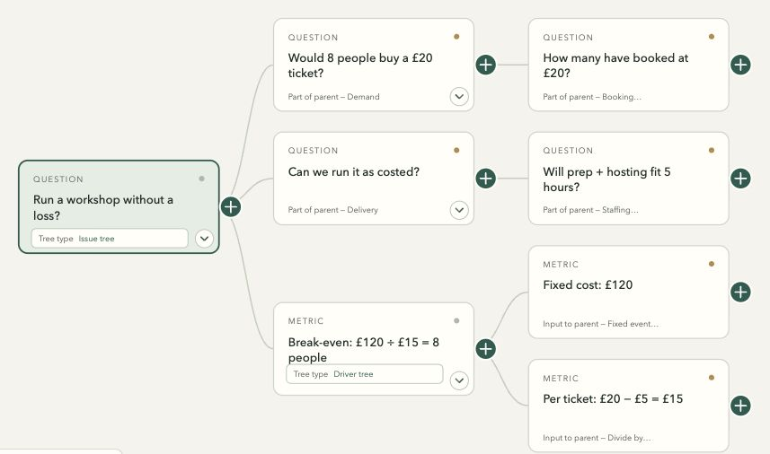

<h1 id="strategy-canvas"></h1>

By [CURN](https://www.curn.io/).

**Turn a question into a tree you can work through.**

- Break a problem into smaller questions.
- Keep notes, assumptions and evidence beside each branch.
- Record a decision or what to check next.

**Use it when you’re:**

- Weighing an opportunity.
- Finding why something isn’t working.
- Explaining a decision.

Work on your own or with your agent. Free and open source.

[Try the example](https://jctkerr.github.io/strategy-canvas/bookshop.html) · [See more trees](https://jctkerr.github.io/strategy-canvas/examples.html)

## With your AI tool

### 1. Open a new conversation

Use your existing account. Use the desktop apps on Mac:

| App | What to click |
| --- | --- |
| **Codex** | New chat. Choose **Local** if asked. |
| **Claude** | **Code** → **Local** → choose a folder for your tree. |
| **Cursor** | Open a folder for your tree, then an **Agent** chat. |

Other agents need to open files and run code. Your usual agent costs apply. [Setup help](docs/agent-guide.md) · [Tested apps](docs/compatibility.md).

### 2. Paste this message

Copy the message below. Replace the last line with your question. Press **Send**.

```text
Install and use Strategy Tree:
https://github.com/jctkerr/strategy-canvas

Read the skill and open the canvas beside our chat.
My question: [type your question]
```

Your agent handles setup.

### 3. Think it through

Your tree should open beside the chat. Work through it together:

- **Explore:** select a branch and tell your agent, “Let's explore this.”
- **Write:** click a card to edit it or add notes. Changes save automatically.
- **Add:** click **+**, type your thought, then click **Add**.
- **Decide:** open **Conclusion**. Write your decision or next check, then click **Save**.

Your agent can use your selection when connected to the tree.

**Return later:** reopen the chat and say, “Reopen my canvas.”

Your work saves on the computer running your agent. Ask for a downloadable copy to keep elsewhere.

[Picture guide](docs/images/strategy-tree-setup-guide.png)

<details>
<summary>More controls</summary>

- **Add another:** keep adding under the same card.
- **⌘/Ctrl K:** find a thought.
- **?**: see the tree types.
- **Details → Move to:** move a branch and its notes.
- Calculations need **Save**, too. Unfinished calculations and Conclusion drafts recover after reload if your browser allows storage.

</details>

## Without an agent

1. [Open a blank tree](https://jctkerr.github.io/strategy-canvas/new.html). Type your question.
2. Click a card to write or add notes. To add a branch, click **+**, type, then **Add**.
3. Choose **Export → Interactive canvas** to keep or share a copy. Check it downloaded.

Your edits stay in this browser if it allows storage. Downloaded copies don’t update each other.

To use these edits with an agent, choose **Export → Editable state (JSON)** and attach the downloaded file.

## A worked example

**Could a bookshop run a workshop without losing money?**

1. **Split the question:** will people pay, can we run it, and what covers costs?
2. **Check the numbers:** a £20 ticket minus £5 materials leaves £15. £120 fixed costs ÷ £15 = **8 paying attendees**.
3. **Choose the next check:** what evidence suggests eight people would book?

These figures are made up. If materials cost £8, you need **10 attendees** instead.

[](https://jctkerr.github.io/strategy-canvas/bookshop.html)

Mix tree types as needed: an **issue tree** splits the question; a **driver tree** breaks down the number.

[Follow the example](docs/worked-example.md) · [Take the tour](https://jctkerr.github.io/strategy-canvas/bookshop.html?tour=1) · [Tree types & sources](references/tree-methods.md)

[Growth example](https://jctkerr.github.io/strategy-canvas/growth.html): ways to grow, calculations and tests.

[MIT licence](LICENSE)
